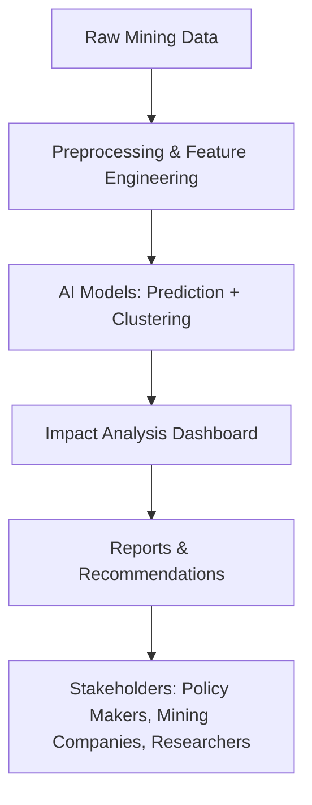

# 🌍 AI-Driven Life Cycle Assessment (LCA) Tool for Mining & Metallurgy  

## 📌 Problem Statement  
Mining and metallurgy industries are resource-intensive and generate significant environmental impacts. Traditional **Life Cycle Assessment (LCA)** methods are manual, time-consuming, and complex.  

Our solution leverages **AI and data-driven models** to:  
- Automate LCA calculations  
- Predict environmental impact (carbon, water, energy)  
- Support circularity and sustainability in mining operations  

---

## 🎯 Objectives  
- Build an **AI-powered LCA tool** for mining and metallurgy.  
- Assess **environmental, energy, and resource impacts** of mining activities.  
- Provide **actionable insights** for sustainability and circularity.  
- Enable decision-makers to optimize processes and reduce carbon footprint.  

---

## 🏗️ System Architecture  

## ⚙️ Tech Stack  

### 🔹 Frontend  
- **React.js** → Interactive web dashboard  
- **React Native (optional)** → Mobile application  
- **TailwindCSS / Material UI** → Modern, responsive UI/UX  
- **Chart.js / D3.js / Plotly** → Data visualization & analytics  

### 🔹 Backend  
- **Flask** → Lightweight ML model serving & APIs  
- **FastAPI** → (Alternative to Flask, for high-performance async APIs)  
- **Django** → (Optional, if advanced user authentication & admin panel needed)  
- **REST / GraphQL APIs** → Data exchange between frontend & backend  

### 🔹 Database  
- **PostgreSQL** → Structured data (LCA datasets, user info, reports)  
- **MongoDB** → Unstructured data (case studies, logs, documents)  

### 🔹 Machine Learning / AI  
- **Scikit-learn / XGBoost** → Classical ML models for prediction  
- **PyTorch / TensorFlow** → Deep learning for advanced modeling  
- **K-Means / DBSCAN / Hierarchical Clustering** → Grouping mines by impact  
- **LangChain + RAG (Retrieval Augmented Generation)** → AI-powered knowledge retrieval from scientific LCA docs  

### 🔹 Deployment & DevOps  
- **Docker** → Containerization for consistent deployment  
- **Kubernetes (optional)** → Orchestration for scaling multiple services  
- **AWS / GCP / Azure** → Cloud hosting (compute + storage)  
- **CI/CD (GitHub Actions / Jenkins)** → Automated builds, tests, deployments  

### 🔹 Tools & Utilities  
- **Jupyter Notebooks** → Model training & experimentation  
- **Pandas / NumPy** → Data preprocessing & feature engineering  
- **Matplotlib / Seaborn** → Data exploration & analysis  
- **Postman / Swagger** → API testing & documentation
   
## 📊 Key Features  

-  **Data Input** → Upload mining process data (energy, water usage, emissions, ore type, production scale).  
-  **AI-Powered Predictions** → Estimate carbon footprint, energy demand, and water usage using trained ML models.  
-  **Clustering & Benchmarking** → Group mines/processes into sustainability clusters (high, medium, low impact).  
-  **Scenario Simulation** → Run *what-if* analysis (e.g., switching to renewable energy, new technology adoption).  
-  **Interactive Dashboard** → Visualize emissions, water usage, and energy consumption with dynamic charts.  
-  **Automated Reports** → Export sustainability insights as **PDF / CSV** reports for compliance & decision-making.  
-  **Knowledge Integration** → Retrieve scientific insights via **RAG AI** from existing LCA and mining databases.  
-  **Multilingual Support** → Accessible in multiple languages for wider adoption across regions.  


## 🚀 Getting Started  

### 1️⃣ Clone the repo  
```bash
git clone https://github.com/<your-org>/mining-lca-ai.git
cd mining-lca-ai
```
### 2️⃣ Install dependencies
```bash

pip install -r requirements.txt
cd frontend && npm install
```
### 3️⃣ Run backend
```bash

python app.py
```
### 4️⃣ Run frontend
```bash

npm start
```
### 📂 Repository Structure
```yaml

mining-lca-ai/
│── backend/              # Flask/Django backend + APIs
│   ├── models/           # ML models (training + inference)
│   ├── routes/           # API endpoints
│   └── utils/            # Helpers, preprocessing
│
│── frontend/             # React.js frontend
│   ├── src/components/   # UI components
│   ├── src/pages/        # Pages (Dashboard, Reports)
│   └── src/assets/       # Images, logos
│
│── data/                 # Sample datasets
│── notebooks/            # ML training notebooks
│── docs/                 # Documentation + diagrams
│── requirements.txt      # Python dependencies
│── README.md             # Project README
```
## 📈 Example Use Case
- 🟢 A copper mine uploads operational data → AI predicts CO₂ emissions, energy, water footprint.

- 🟡 The mine is clustered with other high-emission mines → Recommendations for renewable energy adoption.

- 🔵 The system generates a sustainability report for compliance and investors.

## 📊 KPIs & Evaluation
- Prediction Accuracy → Emission, energy, water usage forecasts

- Clustering Effectiveness → Silhouette score, domain expert validation

- Throughput → Time taken for AI-driven LCA vs manual calculation

- User Adoption → Usability feedback from domain experts & controllers

## 👥 Team Roles
- AI/ML Engineers → Model development & optimization

- Frontend Developers → Dashboard UI/UX

- Backend Engineers → APIs & integration

- Domain Experts (Mining/Metallurgy) → Validation & datasets

## 🌱 Impact
- Supports sustainable mining policies

- Reduces environmental footprint in metallurgy

- Helps India achieve Net Zero & Circular Economy goals

## 📜 License
This project is licensed under the MIT License – free to use and modify.

```pgsql


---

✅ This block is **one-shot complete**, fully GitHub-ready.  

Do you also want me to **add shields.io badges** (Python version, React version, License, B
```
